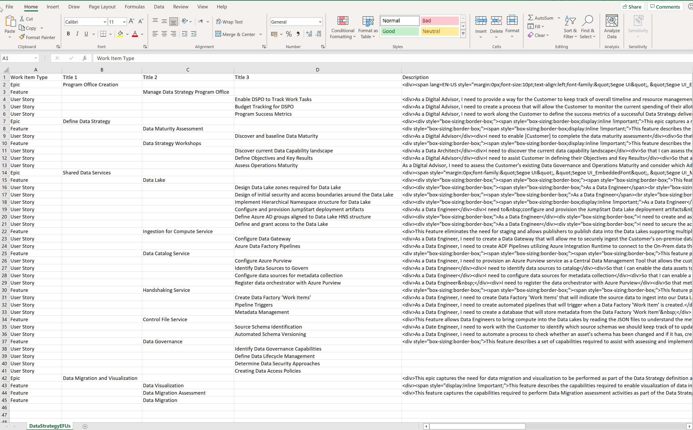
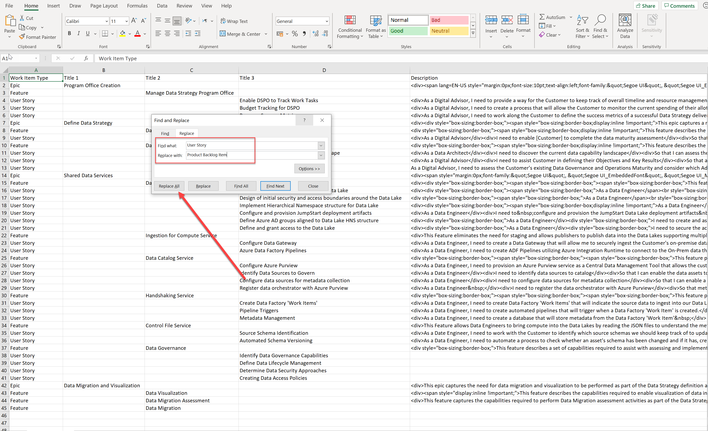
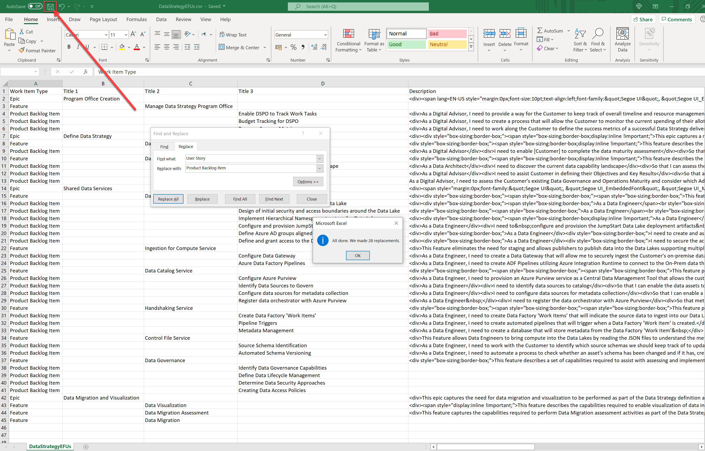
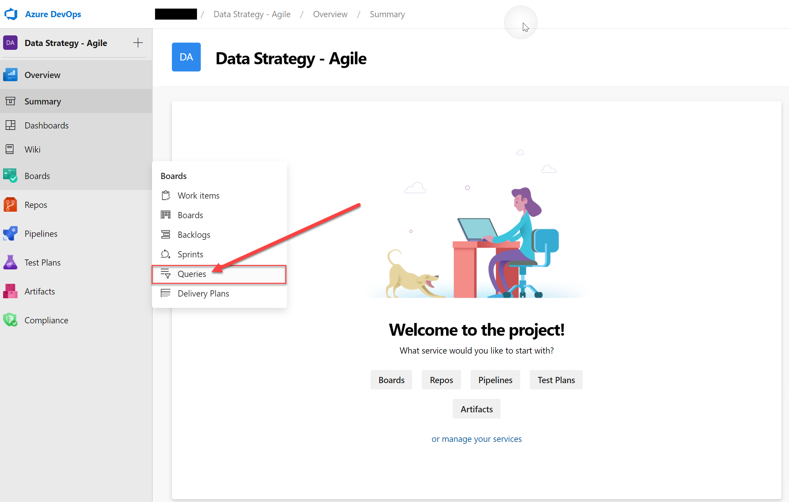
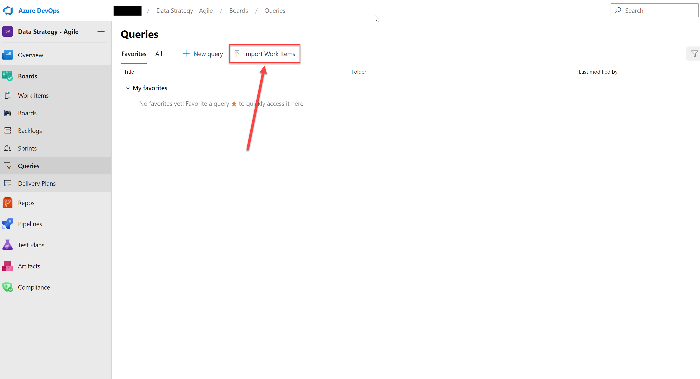
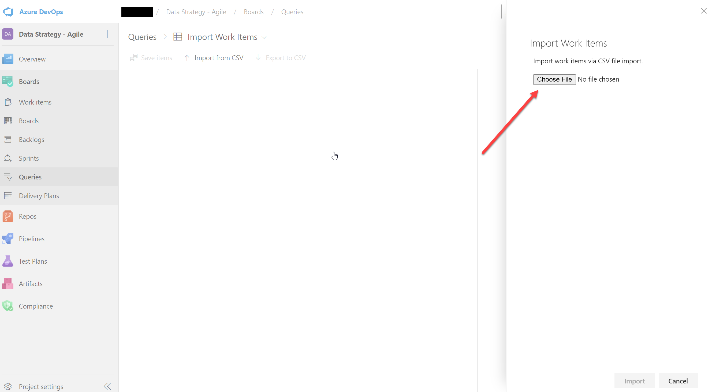
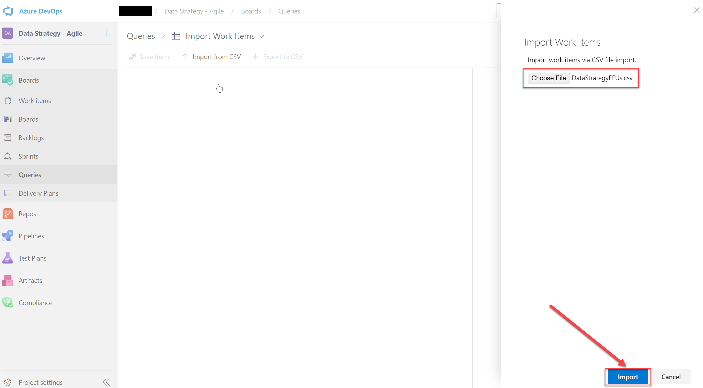
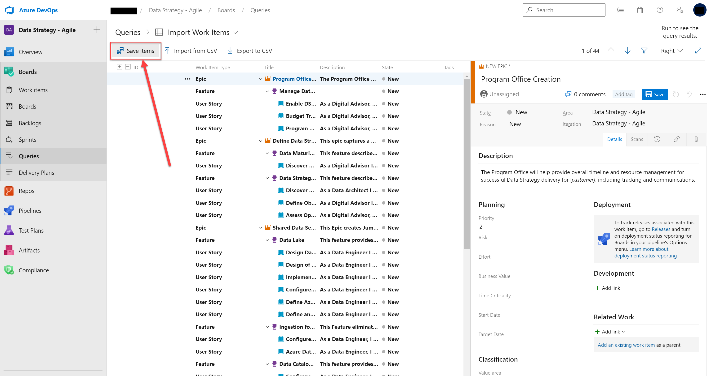

[[_TOC_]]

#Importing Data Strategy Epic, Features and User Stories

The Data Strategy Delivery IP contains a set of reference Epics, Features and User Stories (EFUs) that align to the Services detailed in the Statement of Works. These EFUs can be used to populate a customer Azure DevOps project with an initial set of Work Items to be used to implement the Data Strategy.

> Note: Different customers may have use for some or all of the reference EFUs. It is anticipated that Architects and Consultants will amend the reference EFUs according to the customer needs.

##EFU csv file

The EFUs can be found within the 'DataStrategyEFUs.csv' file located within the 'Backlog' folder within the Azure Artifact containing Data Strategy Delivery IP. Ensure that the artifact has been downloaded to your local PC.

##Scrum Process Template

The csv file containing the reference EFUs assumes that the 'Agile' process template is used. To use the 'Scrum' template, modify the Work Item Type column replace 'User Story' with 'Project Backlog Item'. 

1. Open the 'DataStrategyEFUs.csv' file in Excel.

1. Edit the file, replacing 'User Story' with 'Product Backlog Item'.

1. Save the changes, and close the file.

##Modifications

The Epics, Features and User Stories (or Product Backlog Items) contained within the csv file relate to all outcomes described in the full Data Strategy Statement of Work. If any of these items are not required, delete the relevant entries from the csv prior to importing them into the Customer Azure DevOps instance.

##Steps to Import
To import the Data Strategy work items into the Customer Azure DevOps project, perform the following steps:

1. Within the customer Azure DevOps project, under 'Boards' - select 'Queries'

1. In the main pane, select the 'Import Work Items'

1. Click 'Choose File', and navigate to the local file system where the Data Strategy Artifact e.g. 'C:\Artifacts\DataStrategy\Backlog\DataStrategyEFUs.csv' 

1. Once the 'DataStrategyEFUs.csv' file has been selected, click 'Import'

1. Review the workitems that have been imported to confirm they meet the main Epics and Features that have been agreed. Once this is completed select 'Save items'.

1. Under 'Boards', select 'Backlog' and the reference EFUs will be visible

> For further info, use the following link: [Azure DevOps - Bulk Import](https://docs.microsoft.com/en-us/azure/devops/boards/queries/import-work-items-from-csv?view=azure-devops)

